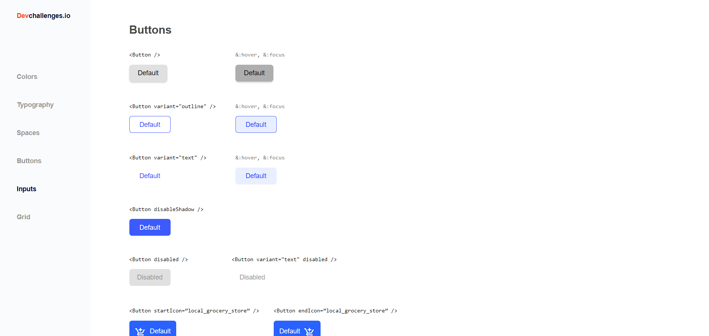

# button-component
Proyecto realizado para el challenge de devChallenges, se replicó la ui de un figma que se entrega. Utilicé ViteJS y TailwindCSS

I tried to replicate just the button component challenge ui, I used Vitejs and TailwindCSS.

:point_right: [Live preview](https://button-component-beta.vercel.app/)

Imagen 1:

